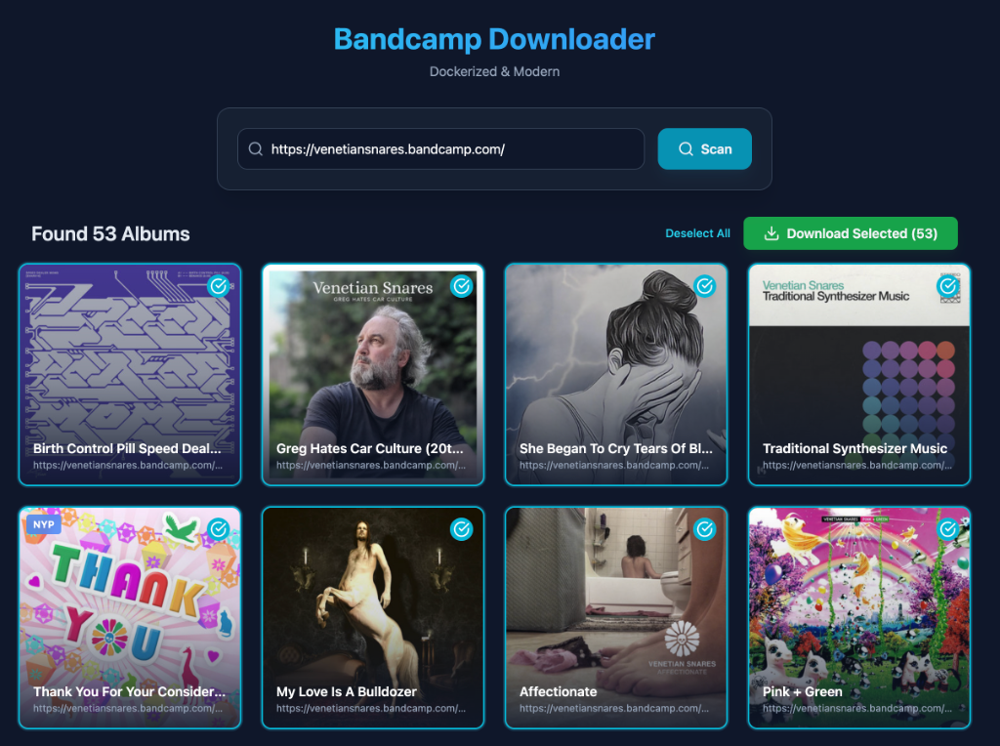

# 🎵 Bandcamp Downloader (Dockerized)


A modern, containerized web application to scan and download albums from Bandcamp artists. Built with **FastAPI**, **React**, and **Playwright**.



## ✨ Features

- **🐳 Dockerized**: Easy deployment with Docker Compose.
- **🔍 Smart Scanning**: Scans artist pages for all available albums.
- **💰 Price Detection**: Automatically detects if an album is **Free**, **Name Your Price (NYP)**, or **Paid**.
- **⚡ Real-time Updates**: Watch albums appear instantly as they are scanned.
- **🖼️ Gallery View**: Beautiful grid layout with album covers.
- **⬇️ Batch Download**: Select multiple albums and download them in one click.
- **🧠 Intelligent**: Handles "Name Your Price" popups automatically (sets price to 0).

## 📖 Glossary

- **FREE**: The album is available for free download immediately.
- **NYP (Name Your Price)**: The artist allows you to pay what you want. The downloader automatically sets the price to **0** to download it for free.
- **PAID**: The album requires a fixed payment. The downloader will **skip** these albums automatically.


## 🚀 Getting Started

### Prerequisites

- [Docker](https://docs.docker.com/get-docker/)
- [Docker Compose](https://docs.docker.com/compose/install/)

### Installation

1. **Clone the repository**
   ```bash
   git clone https://github.com/YOUR_USERNAME/bcdl-deploy.git
   cd bcdl-deploy
   ```

2. **Start the application**
   ```bash
   docker-compose up --build -d
   ```

3. **Access the UI**
   Open your browser and navigate to:
   [http://localhost:3000](http://localhost:3000)

## 🛠️ Configuration

### Download Location
By default, downloads are saved to the `downloads/` directory inside the project folder. To change this, edit `docker-compose.yml`:

```yaml
services:
  backend:
    volumes:
      - /your/custom/path:/app/downloads
```

## 🏗️ Architecture

- **Frontend**: React + Vite + TailwindCSS (Modern UI)
- **Backend**: FastAPI (Python) + Playwright (Browser Automation)
- **Database**: In-memory (Simple & Fast)

## 🤝 Contributing

Contributions are welcome! Please feel free to submit a Pull Request.

## 📄 License

This project is licensed under the MIT License - see the [LICENSE](LICENSE) file for details.
